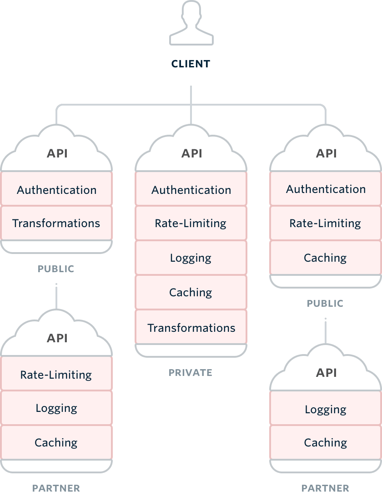
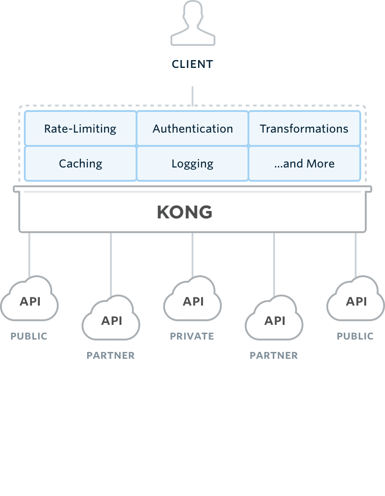

## Kong Plugin Tutorial

#### Note: Modified from [developing-an-helloworld-kong-plugin](http://streamdata.io/blog/developing-an-helloworld-kong-plugin/)

## What is Kong?

Kong is an open-source API proxy based on NGINX, which aims to "secure, manage and extend APIs and Microservices" thanks to a plugins oriented architecture. Ok. Nice sentences but what does it do actually?


| Legacy Architecture                            | Kong Architecture                         |
| ---------------------------------------------- | ----------------------------------------- |
|  | |
| Legacy and Harder to Maintain                  | New and Easier to Maintain                |

## Preparing

#### Git Clone

```
$ git clone https://github.com/jason-riddle/kong-plugin-example.git --recursive
```

OR

```
$ git clone https://github.com/jason-riddle/kong-plugin-example.git
$ git submodule update --init
```

#### Vagrant Up


```
$ cd kong-vagrant/
$ KONG_PATH=../kong/ vagrant up
$ vagrant ssh
vagrant@precise64:~$ cd /kong/
vagrant@precise64:~$ sudo make dev
```

## Let's code our plugin!

First, you need to create the following 3 files in `$KONG_PATH/kong/plugins/helloworld`.

```
kong/
├── kong/
│    └── plugins/
│         └── helloworld/
│               ├── access.lua
│               ├── handler.lua
│               └── schema.lua
└── ...
```

- <code>access.lua</code>: This will contain the core logic for the plugin (Adding the header "Hello-World" to the response)

- <code>handler.lua</code>: We will declare our new helloworld plugin in here

- <code>schema.lua</code>: Define the configuration schema of the plugin.

#### schema.lua

```lua
return {
  no_consumer = true,
  fields = {
    say_hello = { type = "boolean", default = true }
  }
}
```

In this case, tell Kong that our plugin does not handle consumers (see [Kong's docs](https://getkong.org/docs/0.5.x/getting-started/adding-consumers/) on more about this) and has one boolean configuration parameter: <code>say_hello</code>, whose default value is <code>true</code>.

#### handler.lua

```lua
local BasePlugin = require "kong.plugins.base_plugin"
local access = require "kong.plugins.helloworld.access"

local HelloWorldHandler = BasePlugin:extend()

function HelloWorldHandler:new()
  HelloWorldHandler.super.new(self, "helloworld")
end

function HelloWorldHandler:access(conf)
  HelloWorldHandler.super.access(self)
  access.execute(conf)
end

return HelloWorldHandler
```

#### access.lua

```lua
local _M = {}

function _M.execute(conf)
  if conf.say_hello then
    ngx.log(ngx.ERR, "============ A World! ============")
    ngx.header["a-world"] = "a-world"
  else
    ngx.log(ngx.ERR, "============ B World! ============")
    ngx.header["b-world"] = "b-world"
  end
  ngx.log(ngx.ERR, "============ C World! ============")
  ngx.header["c-world"] = "c-world"
end

return _M
```

## Let's register our plugin in Kong

#### $KONG_PATH/kong-0.5.0-1.rockspec

```lua
package = "kong"
version = "0.5.0-1"
supported_platforms = {"linux", "macosx"}
source = {
  url = "git://github.com/Mashape/kong",
  tag = "0.5.0"
}
description = {
  ...
}
dependencies = {
  ...
}
build = {
  type = "builtin",
  modules = {
    ...

    ["kong.plugins.hmac-auth.handler"] = "kong/plugins/hmac-auth/handler.lua",
    ["kong.plugins.hmac-auth.access"] = "kong/plugins/hmac-auth/access.lua",
    ["kong.plugins.hmac-auth.schema"] = "kong/plugins/hmac-auth/schema.lua",
    ["kong.plugins.hmac-auth.api"] = "kong/plugins/hmac-auth/api.lua",
    ["kong.plugins.hmac-auth.daos"] = "kong/plugins/hmac-auth/daos.lua",

    ["kong.plugins.helloworld.handler"] = "kong/plugins/helloworld/handler.lua",
    ["kong.plugins.helloworld.access"] = "kong/plugins/helloworld/access.lua",
    ["kong.plugins.helloworld.schema"] = "kong/plugins/helloworld/schema.lua"

  },
  install = {
    ...
  }
}
```

## Let's configure the kong.yml

#### $KONG_PATH/kong.yml

```lua
## Available plugins on this server
plugins_available:
  - ssl
  - jwt
  - acl
  - cors
  - oauth2
  - tcp-log
  - udp-log
  - file-log
  - http-log
  - key-auth
  - hmac-auth
  - basic-auth
  - ip-restriction
  - mashape-analytics
  - request-transformer
  - response-transformer
  - request-size-limiting
  - rate-limiting
  - response-ratelimiting
  - helloworld

  ...
```

Run the following to generate <code>kong_DEVELOPMENT.yml</code>

```
vagrant@precise64:/kong$ sudo make dev
```

## Let's unit test!

```lua
kong/
├── spec/
│    └── plugins/
│         └── helloworld/
│               └── access_spec.lua
└── ...
```

#### access_spec.lua

```lua
local spec_helper = require "spec.spec_helpers"
local http_client = require "kong.tools.http_client"

local STUB_GET_URL = spec_helper.STUB_GET_URL
local STUB_POST_URL = spec_helper.STUB_POST_URL

describe("HelloWorld Plugin", function()

  setup(function()
    spec_helper.prepare_db()

    spec_helper.insert_fixtures {
      api = {
        { name = "tests-helloworld3", request_host = "mockbin1.com", upstream_url = "http://mockbin.com" },
        { name = "tests-helloworld4", request_host = "mockbin2.com", upstream_url = "http://mockbin.com" }
      },
      plugin = {
        { name = "helloworld", config = { say_hello = true }, __api = 1 },
        { name = "helloworld", config = { say_hello = false }, __api = 2 },
      }
    }

    spec_helper.start_kong()
  end)

  teardown(function()
    spec_helper.drop_db()
    spec_helper.stop_kong()
  end)

  describe("Response", function()

     it("should return an a-world header with a-world value when say_hello is true", function()
        local _, status, headers = http_client.get(STUB_GET_URL, {}, {host = "mockbin1.com"})
        -- for key,value in pairs(headers) do print(key,value) end
        assert.are.equal(200, status)
        assert.are.same("a-world", headers['a-world'])
        assert.is.falsy(headers['b-world'])
        assert.is.truthy(headers['c-world'])
      end)

     it("should return an b-world header value with b-world when say_hello is false", function()
        local _, status, headers = http_client.get(STUB_GET_URL, {}, {host = "mockbin2.com"})
        -- for key,value in pairs(headers) do print(key,value) end
        assert.are.equal(200, status)
        assert.is.falsy(headers['a-world'])
        assert.are.same("b-world", headers['b-world'])
        assert.is.truthy(headers['c-world'])
      end)

     -- it("should return an Hello-World headasdasdorld!!! value when say_hello is true", function()
     --    local _, status, headers = http_client.get(STUB_GET_URL, {}, {host = "mockbin2.com"})
     --    -- for key,value in pairs(headers) do print(key,value) end
     --    assert.are.equal(200, status)
     --    assert.is.falsy(headers['A-world'])
     --    assert.is.falsy(headers['B-world'])
     --    assert.is.falsy(headers['C-world'])
     --  end)

  end)
end)
```

To test all plugins

```
vagrant@precise64:/kong$ sudo make test-plugins
```

To test only the helloworld plugin

```
vagrant@precise64:/kong$ sudo busted -v spec/plugins/helloworld
```